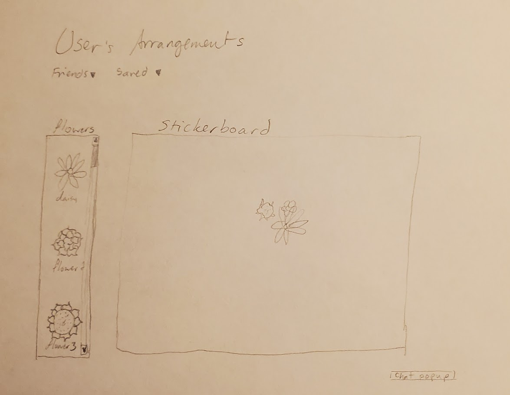

# Bouquet
260 project winter 2024
 (docs/notes.md)
## Specification Deliverable
A general idea of what this project will hopefully look like
### Elevator Pitch
Are you struggling to decide what you want your wedding bouquet to look like, but you don’t want to go to a florist yet? Need floral inspiration for some other reason? The Bouquet app is here to help you visualize your arrangements. Find your flowers and greens and add them to the stickerboard. Move stickers around the board until you find just what you are looking for! Save an arrangement on your account to remember what plants you used.
### Design

### Key Features
+ Secure login over HTTPS
+ Display of flower sticker choices
+ Stickerboard
+ Ability to stick flowers to board
+ Ability to save arrangements
+ List of saved arrangements
+ List of community arrangements
+ (changed friendslist and chatbox in favor of the list of community arrangements)
### Technologies
+ HTML - Uses correct HTML structure for application. Four HTML pages. One for login, one for arranging, one for saved arrangements, and one for the about page.
+ CSS - Application styling that looks good on different screen sizes, uses good whitespace, color choice and contrast.
+ JavaScript - Provides login, choice display, chatbox display, stickerboard display.
+ Service - Backend service with endpoints for:
  + login
  + retrieving choices
  + displaying flowers
  + recalling saved arrangements
+ DB/Login - Store users in database. Register and login users. Credentials securely stored in database.
+ WebSocket - live updates on list of shared community arrangements
+ React - Application ported to use the React web framework.
 
## CSS Deliverable
For this deliverable, I styled the application into an approximation of its final appearance.
+ Header, footer, and main content body
+ Navigation elements - I changed the appearance and orientation of my navbar
+ Responsive to window resizing - My app appears adequate with differing window sizes.
+ Application elements - colored and positioned elements neatly
+ Application text content - Consistent fonts
+ Application images - still working on adding the stickers, but added a couple of other images that are nice.

## JavaScript Deliverable
+ login - upon pressing "login", redirected to "Create" page; saved username in local storage
+ database - display canvas images to Arrangements page as saved on Create page. Intend to add ability to load user-saved images on other devices (and to present more than one saved image at once)
+ websocket - display of community arrangements will be replaced with websocket messages
+ interaction logic - ability to interact with Create page: flower box, buttons, and stickerboard

## Service Deliverable
backend endpoints
+ Node.js/Express Service - done
+ Static Middleware for frontend - done
+ calls to third party endpoints - added fetch function for quote on create page
+ backend service endpoints - (middleware in index.js)
+ frontend calls service endpoints - (calling that middleware as necessary)